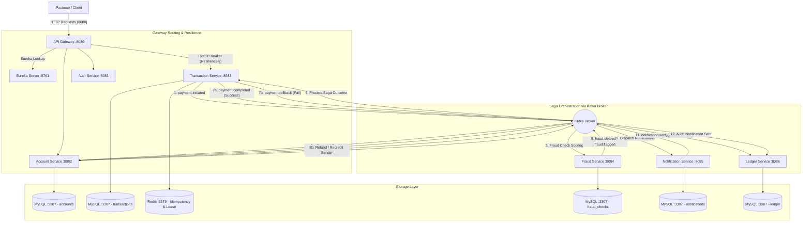

# 💳 PayFlow: Distributed Event-Driven Payment Orchestration Platform

[](https://github.com)
[](https://github.com)
[](https://github.com)
[](https://github.com)

PayFlow is a production-grade, highly resilient microservices payment orchestration engine. It coordinates distributed transactions using an asynchronous **Saga Pattern** across distinct databases while guaranteeing strict idempotency, real-time rule-based fraud detection, automated rollback compensations, immutable ledger auditing, and fault-tolerant gateway circuit-breaking.

---

## 🏗️ System Architecture

PayFlow routes all public traffic through a unified **API Gateway**, resolved dynamically via the **Eureka Service Registry**. The core transactional and post-processing steps are orchestrated asynchronously via **Apache Kafka** event topics, as illustrated below:



---

## 🎯 9 Core System Achievements & Goals

### 1. Unified Gateway Routing & Registry
* **Dynamic Routing**: The API Gateway (`8080`) serves as the single entry point. It dynamically rewrites and forwards routes (`/api/v1/accounts/**` $\rightarrow$ `account-service`, `/api/v1/payments/**` $\rightarrow$ `transaction-service`).
* **Service Registry**: Eureka Server (`8761`) manages service registration and health status, enabling client-side load balancing.

### 2. Event-Driven Safe Processing (Saga Pattern)
When Rahul sends ₹5,000 to Priya, the orchestrator guarantees sequence-safe processing:
1. **Validate Balance**: Verifies Rahul holds $\ge$ ₹5,000.
2. **Debit Sender**: Deducts ₹5,000 from Rahul's account.
3. **Fraud Evaluation**: Checks the transaction safety score.
4. **Credit Receiver**: Adds ₹5,000 to Priya's account.
5. **Dispatch Notifications**: Informs both parties of the transfer status.
6. **Ledger Auditing**: Writes all state transitions to an immutable record.

### 3. Strict Idempotency Guards
* Prevents accidental double-charging due to network delays or duplicate form submissions.
* Uses **Redis Lease Locks** during processing and caches the final response for **24 hours** keyed by `Idempotency-Key` headers. Duplicate requests immediately return the cached payload without executing downstream logic.

### 4. Real-Time Fraud Rule Engine
Every payment is screened by the `fraud-service` and assigned a risk score based on configured rules:
* **Amount is over ₹10,000**: `+40` points
* **3+ payments in the last 60 seconds**: `+30` points (tracked using sliding-window Redis counters)
* **Payment during off-hours (12 AM - 5 AM)**: `+20` points
* **Sender account age is less than 30 days**: `+10` points (fetched dynamically via OpenFeign from `auth-service`)

> 🚫 **Fraud Threshold**: If the total score is **$\ge 60$**, the payment is automatically blocked (`FLAGGED`), the money is returned, and a security alert is dispatched.

### 5. Automated Compensating Transactions (Saga Rollback)
If a transaction fails at any stage (e.g., fraud block, insufficient balance, downstream crash):
* The Saga Orchestrator transitions the transaction state to `FAILED`.
* Emits a `payment.rollback` event.
* The `account-service` consumes the rollback event and **automatically deposits the money back** into the sender's account, preventing partial state failures.

### 6. Personalized User Notification Dispatch
* Tailors messages based on context and user names dynamically looked up from `auth-service` via OpenFeign:
  * **Success - Sender**: `"You sent ₹5000.00 to Priya"`
  * **Success - Receiver**: `"You received ₹5000.00 from Rahul"`
  * **Fraud Block**: `"Your payment of ₹15000.00 was blocked. Reason: Fraud check flagged (Score: 70). Money returned to your account."`
* Persists notifications with `userId` references for in-app alert feeds.

### 7. Immutable Ledger Audits
* The `ledger-service` listens to all core Kafka topics (`payment.initiated`, `account.debited`, `fraud.cleared`, `payment.completed`, `payment.rollback`, `notification.sent`).
* Logs each lifecycle change to an append-only database table. Since no update or delete APIs exist, this forms a **tamper-proof chronological timeline**.

| Timestamp | Event Type | Details |
| :--- | :--- | :--- |
| `10:30:00` | `PAYMENT_INITIATED` | Rahul $\rightarrow$ Priya |
| `10:30:01` | `ACCOUNT_DEBITED` | Rahul $-\text{₹}5,000$ |
| `10:30:02` | `FRAUD_CLEARED` | Score: 10, Passed |
| `10:30:03` | `PAYMENT_COMPLETED` | Priya $+\text{₹}5,000$ |
| `10:30:04` | `NOTIFICATION_SENT` | Alerts dispatched to Rahul & Priya |

### 8. Concurrent Balance Locking
* Protects against double-spend exploits (e.g., trying to send the same ₹5,000 twice at the exact same millisecond).
* Employs **JPA Optimistic Locking** (`@Version`) on the accounts table. If concurrent updates occur, one transaction commits successfully while the duplicate update throws an `ObjectOptimisticLockingFailureException`, aborting safely.

### 9. Gatekeeper Circuit Breaking (Fault Tolerance)
* Configured using **Resilience4j** at the API Gateway level.
* If `transaction-service` experiences degradation or goes offline, the gateway halts routing to it and yields a standardized fallback JSON payload:
  ```json
  {
    "status": "SERVICE_UNAVAILABLE",
    "message": "Payment service temporarily unavailable. Please try again in a moment."
  }
  ```
* The circuit breaker remains open for **10 seconds** before entering a half-open state to check service recovery.

---

## 🛠️ Comprehensive Tech Stack

| Component | Technology | Detail & Configuration |
| :--- | :--- | :--- |
| **Language Runtime** | Java 17 | JDK 17, Spring Boot 3.x framework base. |
| **Gateway Routing** | Spring Cloud Gateway | Path rewriting, service routing, custom fallbacks. |
| **Registry Discovery**| Spring Cloud Eureka Server | Microservice metadata registry on port `8761`. |
| **Message Broker** | Apache Kafka & Zookeeper | Event distribution and asynchronous Saga queues. |
| **Fault Tolerance** | Resilience4j | Gateway circuit-breaker and client fallback limits. |
| **In-Memory Cache** | Redis | Sliding-window fraud tracking, idempotency cache, lease locks. |
| **Database Storage** | MySQL 8.0 | Separate isolated schema databases for each microservice. |
| **Inter-Service REST**| Spring Cloud OpenFeign | Synchronous API calls (e.g. user details retrieval). |
| **Data Access** | Spring Data JPA / Hibernate | Object-Relational Mapping with `@Version` optimistic locking. |
| **Build Engine** | Apache Maven | Multi-module parent POM management. |

---

## 🚀 Local Run Instructions

### Prerequisites
* **Java 17 (JDK)** installed and configured in your system `PATH`.
* **Docker Desktop** running.
* **Postman** installed (to run our automated E2E tests).

### Step-by-Step Deployment

#### 1. Spin up Core Containers
Boot the databases, cache, and message brokers in the background:
```bash
docker compose up -d
```
Confirm all Docker containers are running and healthy:
```bash
docker compose ps
```

#### 2. Build Services via Maven
From the root directory of the workspace, run:
```bash
./maven/apache-maven-3.9.6/bin/mvn clean compile
```

#### 3. Start the Microservices
Execute the startup scripts to open separate execution contexts for each of the 8 services:
* **On Windows Command Prompt**:
  ```cmd
  start-services.bat
  ```
* **On Windows PowerShell**:
  ```powershell
  Set-ExecutionPolicy Bypass -Scope Process; .\start-services.ps1
  ```

---

## 🧪 Verifying End-to-End Execution

A pre-configured Postman automated test collection is stored at the root: **`PayFlow_E2E_Test_Collection.postman_collection.json`**.

1. **Import** the collection into Postman.
2. Run **`1. Register Sender User`** and **`2. Register Receiver User`** to seed user profiles.
3. Run **`3. Login Sender`** to authorize and cache JWT credentials.
4. Create initial account balances using **`4. Create Sender Account`** (Rahul - ₹10,000) and **`5. Create Receiver Account`** (Priya - ₹2,000).
5. Post a transfer of ₹5,000 via **`6. Post Payment Transaction`**.
6. Query **`5b. Check Account Balance`** to confirm the final state:
   * **Rahul**: ₹5,000 remaining.
   * **Priya**: ₹7,000 total.
7. To test **Fraud Detection & Automatic Rollback**:
   * Attempt to send ₹15,000. It will fail risk scoring ($\ge 60$ points).
   * Verify via balance checks that the debited money was automatically returned to the sender.
